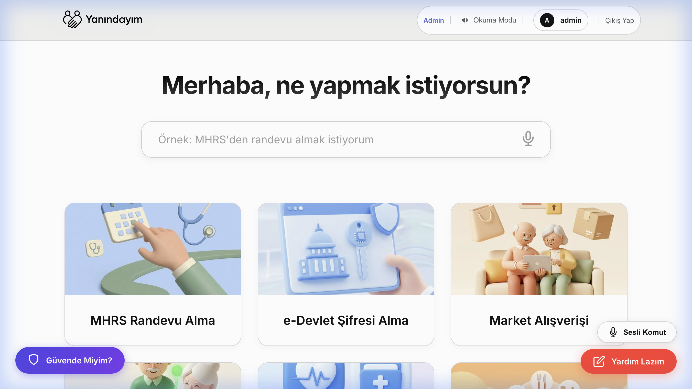
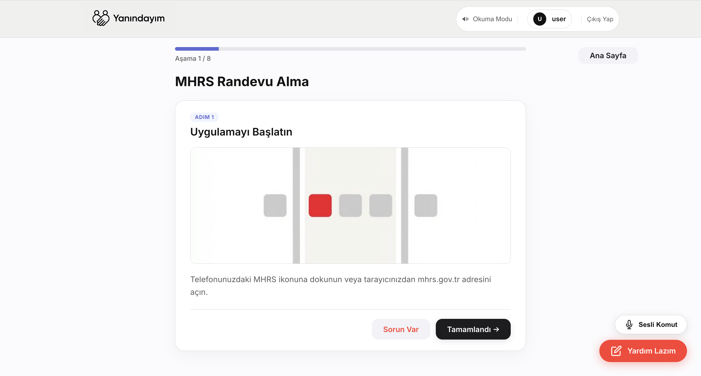
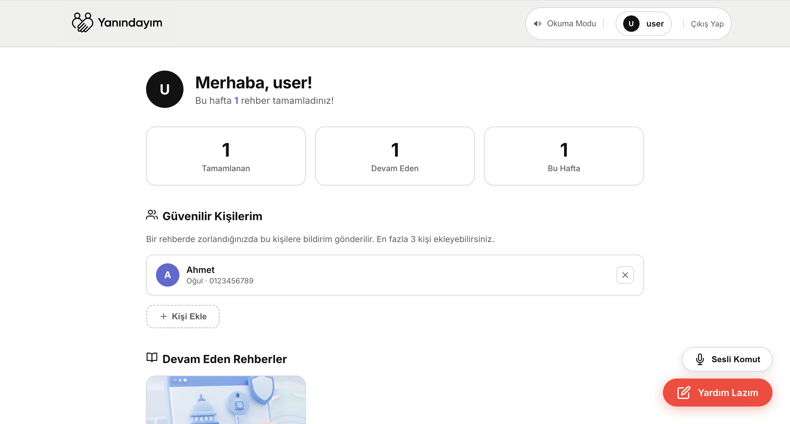
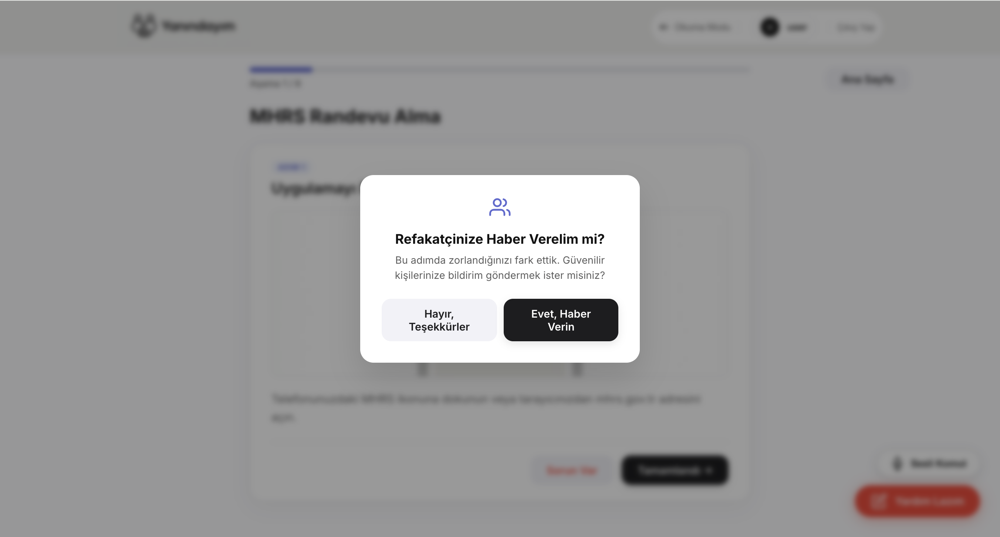

# Yanındayım


**Yanındayım** (I am by your side) is an elderly-friendly Turkish web application that helps senior citizens navigate the digital world with confidence. It provides simplified, step-by-step guides for essential tasks like e-Devlet access, medical appointments (MHRS), and everyday digital activities.

Built with accessibility and trust at its core, the app features AI-powered assistance, voice navigation, AI-generated SVG illustrations, fraud awareness training, and a companion mode that notifies trusted contacts when users are struggling.

---

## Screenshots

### Home Page
The landing page showcases available guides with visual cards and a search bar for quick access.



### Guide Steps
Interactive step-by-step guides with progress tracking, AI-generated SVG illustrations, and AI-powered help when users get stuck.



### User Profile & Companion Mode
Personal dashboard with progress stats, trusted contacts management (Refakatçi Modu), and guide history.



### Companion Notification
When a user struggles (3+ help requests), the system offers to notify their trusted contacts.



---

## Features

### Core
- **Elderly-Friendly UI** — Minimalist Apple/Linear-inspired design with large typography, high contrast, and simple navigation
- **Step-by-Step Guides** — Interactive walkthroughs with progress bars, visual illustrations, and resume functionality
- **AI-Powered Help** — Google Gemini provides calming, simplified technical assistance when users get stuck
- **AI-Generated SVG Illustrations** — Gemini generates clean, minimalist vector graphics for each guide step automatically
- **Voice Navigation** — Hands-free control with Turkish voice commands (İleri, Geri, Sorun Var)

### User Progress
- **Server-Side Progress Tracking** — Saves guide progress to the server for logged-in users
- **Resume from Last Step** — Users can pick up exactly where they left off
- **Profile Dashboard** — Stats on completed guides, in-progress guides, and weekly streak

### Companion Mode (Refakatçi Modu)
- **Trusted Contacts** — Users can add up to 3 trusted people (children, neighbors, friends)
- **Frustration Detection** — System detects when users are struggling (3+ problem reports)
- **Notification System** — Offers to notify trusted contacts with guide/step context

### Safety & Accessibility
- **Fraud Awareness Training** — AI-generated interactive scenarios teaching users to recognize scams
- **Reading Mode** — Simplified text display for better readability
- **PWA Support** — Installable as a mobile app with offline capabilities
- **Admin Dashboard** — Tools for managing guides, testing walkthroughs, and managing fraud scenarios

---

## Tech Stack

| Layer | Technology |
|-------|------------|
| **Backend** | [FastAPI](https://fastapi.tiangolo.com/) (Python 3.9+) |
| **Database** | [PostgreSQL 15](https://www.postgresql.org/) + [SQLAlchemy ORM](https://www.sqlalchemy.org/) |
| **Frontend** | Jinja2 Templates, Vanilla CSS, JavaScript |
| **AI** | [Google Gemini API](https://ai.google.dev/) — text assistance, guide generation, SVG illustration, fraud scenarios |
| **Containerization** | [Docker](https://www.docker.com/) & [Docker Compose](https://docs.docker.com/compose/) |

---

## Getting Started

### Prerequisites

- Docker and Docker Compose
- Google Gemini API Key ([get one here](https://aistudio.google.com/apikey))

### Setup

```bash
# 1. Clone the repository
git clone <repository-url>
cd Yanındayım

# 2. Configure environment variables
cp .env.example .env
# Edit .env and add your Google API key

# 3. Start the application
docker compose up --build

# 4. Open in browser
open http://localhost:8000
```

---

## Project Structure

```
.
├── app/
│   ├── main.py                  # FastAPI entry point & middleware config
│   ├── database.py              # SQLAlchemy engine & session factory
│   ├── models.py                # Database models (User, Guide, GuideStep, etc.)
│   ├── routers/
│   │   ├── admin.py             # Admin dashboard, guide CRUD, fraud scenarios
│   │   ├── auth.py              # Authentication (login, register, logout)
│   │   └── pages.py             # Public pages, search, companion mode, progress
│   ├── static/
│   │   ├── css/style.css        # Complete design system
│   │   ├── js/
│   │   │   ├── guide-steps.js   # Step navigation & progress tracking
│   │   │   ├── voice-nav.js     # Turkish voice command recognition
│   │   │   ├── global-help.js   # AI-powered help modal
│   │   │   ├── reading-mode.js  # Simplified reading mode
│   │   │   ├── safety.js        # Fraud awareness training
│   │   │   └── search.js        # Guide search functionality
│   │   ├── img/                 # Static UI illustrations & icons
│   │   ├── generated/           # AI-generated SVG step illustrations
│   │   ├── sw.js                # Service worker for PWA
│   │   └── manifest.json        # PWA manifest
│   ├── templates/               # Jinja2 HTML templates (11 files)
│   └── utils/
│       ├── ai_utils.py          # Gemini integration (guides, SVG, help, fraud)
│       └── companion.py         # Companion mode notification formatter
├── docker-compose.yml           # Multi-container orchestration (web + db)
├── Dockerfile                   # Python 3.9 web service container
├── init.sql                     # Database schema & seed data
├── requirements.txt             # Python dependencies
└── .env.example                 # Environment variable template
```

---

## Database Models

| Model | Purpose |
|-------|---------|
| `User` | User accounts with roles (user/admin) |
| `Guide` | Step-by-step guide metadata |
| `GuideStep` | Individual steps with title, description, and SVG illustration |
| `UserGuideProgress` | Per-user progress tracking with resume support |
| `TrustedContact` | Companion mode trusted contacts (up to 3) |
| `CompanionAlert` | Notification log when trusted contacts are alerted |
| `StepProblem` | Tracks user-reported problems per step |
| `Idea` | User-submitted guide requests |
| `FraudScenario` | Stored fraud awareness training scenarios |

---

## AI Features

The app uses **Google Gemini** for four distinct AI capabilities:

| Feature | Function | Model |
|---------|----------|-------|
| **Guide Generation** | Creates full step-by-step guides from a prompt | `gemini-flash-latest` |
| **SVG Illustration** | Generates minimalist vector illustrations per step | `gemini-2.0-flash` |
| **Help Assistant** | Provides calming, context-aware technical help | `gemini-flash-latest` |
| **Fraud Scenarios** | Generates realistic scam scenarios for training | `gemini-flash-latest` |

### SVG Generation

When creating a guide in the admin panel, toggling **"Yapay Zeka Görseli Üret"** generates a unique SVG illustration for each step. The SVGs are:

- **True vector graphics** — scalable to any size without quality loss
- **Lightweight** — ~2-5 KB per image (vs 300 KB–1.7 MB for raster)
- **Cached** — MD5-hashed filenames prevent regeneration
- **Consistent style** — flat design with a professional blue/purple/orange palette

---

## Environment Variables

| Variable | Required | Description |
|----------|----------|-------------|
| `DATABASE_URL` | ✅ | PostgreSQL connection string |
| `GOOGLE_API_KEY` | ✅ | Google Gemini API key (powers all AI features) |
| `SESSION_SECRET_KEY` | ✅ | Secret key for session encryption |
| `POSTGRES_USER` | ✅ | Database username (Docker) |
| `POSTGRES_PASSWORD` | ✅ | Database password (Docker) |
| `POSTGRES_DB` | — | Database name (default: `yanindayim`) |

---

## License

This project is licensed under the MIT License — see the [LICENSE](LICENSE) file for details.
